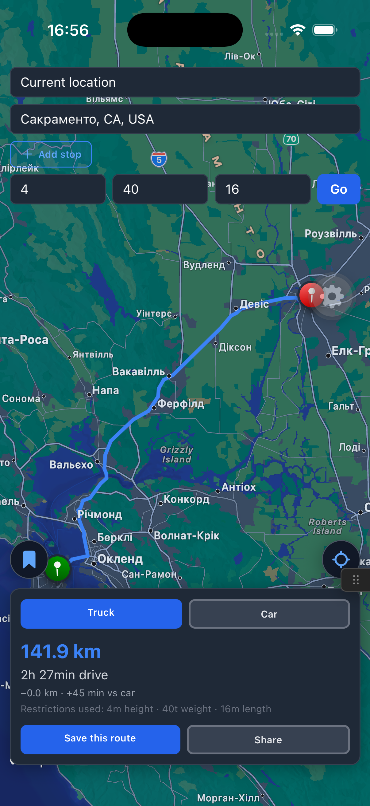
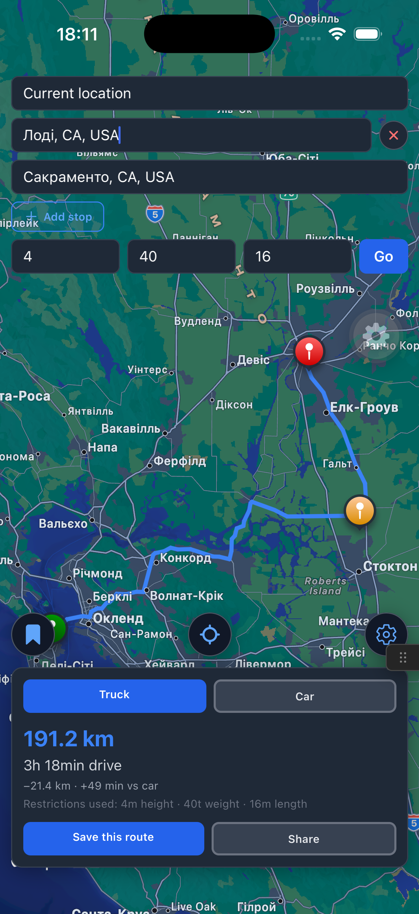
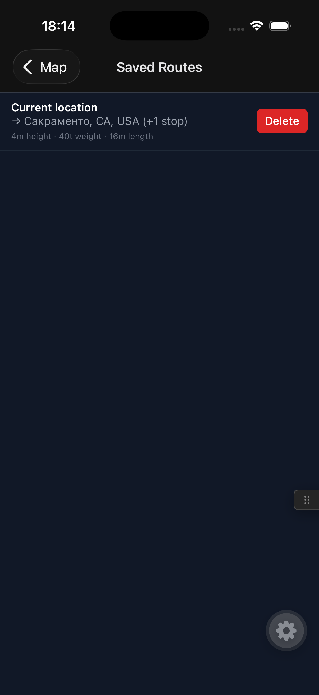

# RouteRig


A truck-aware route planner. Regular navigation apps route trucks the same way
they route cars — ignoring height, weight, and length restrictions — which is
how trucks end up stuck under low bridges. RouteRig plans routes that actually
account for the vehicle, and shows the truck route next to the regular car
route so the difference is visible.

Built as a portfolio project to practice native module integration, the Expo
dev client workflow, and clean feature-based architecture in React Native.

## Screenshots

| Map + route comparison | Multi-stop route planning | Saved routes |
| --- | --- | --- |
|  |  |  |

## Features

- Full-screen map with foreground geolocation (origin defaults to current
  location)
- Address search (autocomplete) for origin, destination, and any number of
  intermediate stops
- Truck parameters form (height, weight, length), remembered as a truck
  profile so it doesn't need retyping next time
- Truck route vs. car route, rendered side by side on the map with a
  distance/duration comparison card and a "+X km / +Y min vs car" delta
- Save routes locally and reopen them later, pre-filled
- Share a route summary via the native share sheet
- Local notification when approaching the destination, tracked in the
  background
- Offline banner when the device has no network connection
- Dark theme throughout, including native map tiles on iOS

## Tech stack

- **Expo** (dev client, not Expo Go — the app uses custom native modules) +
  **React Native** + **TypeScript**
- **react-native-maps** for the map (Apple Maps on iOS, Google Maps on
  Android — left as native defaults rather than forcing one provider on both
  platforms)
- **TanStack Query** for all server state (geocoding, routing, saved routes)
- **NativeWind** (Tailwind) for styling
- **React Navigation** (native stack) for the two screens
- **AsyncStorage** for saved routes and the remembered truck profile
- **expo-notifications** + **expo-location** + **expo-task-manager** for the
  background proximity alert
- **@react-native-community/netinfo** for the offline banner
- **OpenRouteService** for geocoding and truck/car routing
- **Buoy** (`@buoy-gg/*`) as an in-app dev-tools overlay during development
  (network/AsyncStorage/TanStack Query inspection, perf monitor) — gated
  behind `__DEV__`

No client-state library (Zustand, Redux, etc.) — all state ended up being
either local `useState` in the screen that owns it, or server state already
handled by TanStack Query. Zustand was installed early on the assumption it'd
be needed and removed once it became clear it wasn't; better than keeping an
unused dependency around.

## Architecture

Feature-based structure: each domain area owns its screens, components,
hooks, and API layer.

```
src/
  app/                 navigation, providers, entry point
  features/
    map/                map screen, geolocation hook
    route-planning/      address search, waypoint list, truck params form,
                           routing API, route summary card
    saved-routes/        AsyncStorage layer, saved routes screen
    truck-profile/        AsyncStorage layer for the remembered truck profile
    notifications/        proximity notification hook + the background task
                           it starts (tasks/proximity-task.ts)
  shared/
    components/          reusable UI (AppTextInput, IconButton, OfflineBanner)
    constants/            shared design tokens (route colors)
    hooks/                cross-feature hooks (useIsOffline)
    utils/                pure functions (distance formatting, haversine)
```

Each feature's API layer returns typed, UI-ready data — components never see
raw OpenRouteService response shapes. Pure logic (distance formatting,
haversine distance, request-body building) is separated from anything that
touches `fetch`, React, or React Native, specifically so it can be unit
tested without mocking a network or a component tree.

## Notable decisions

- **Routing API is OpenRouteService, not HERE.** HERE Truck Routing was the
  original choice (richer restriction parameters, bigger name in the
  logistics industry) but its free tier requires a credit card on file. ORS
  needs no billing information and has a truck/HGV profile that covers the
  same core need.
- **Background location tracking, added after the MVP.** Originally scoped
  out for the reasons above (background-mode setup is a well-known time sink,
  and it needs a physical device to test), but added once the rest of the app
  was solid. Uses `expo-task-manager` + `expo-location`'s
  `startLocationUpdatesAsync` with a module-level task (`proximity-task.ts`)
  defined at the JS entry point, since the OS can invoke it without the app's
  React tree being mounted. Android requires a foreground service (persistent
  notification while tracking) and a separate background-location permission
  request after the foreground one is granted; iOS requires "Always" location
  permission.
- **Native map providers, not forced parity.** iOS uses Apple Maps and
  Android uses Google Maps (react-native-maps' default per platform). Forcing
  Google Maps on both would need a second Google Cloud API key and a billing
  card just for visual consistency — not worth it.

## Setup

Requires an [OpenRouteService](https://openrouteservice.org/dev/#/signup) API
key (free, no billing info required).

```bash
npm install
cp .env.example .env   # add your OpenRouteService key
npx eas-cli build --profile development --platform all
npx expo start --dev-client
```

react-native-maps needs a Google Maps API key for Android — set
`androidGoogleMapsApiKey` in `app.json`'s `react-native-maps` plugin config
before building for Android.

## Testing

```bash
npm test
```

Tests cover pure logic only: distance/duration formatting, haversine
distance, and the OpenRouteService request-body builder (coordinate order is
`[longitude, latitude]`, a common source of bugs). No component or
integration tests — the ROI on mocking React Native components wasn't worth
it for this project's size.

## Known limitations

- Offline handling is a banner ("no internet connection"), not a queued/retry
  system — requests still just fail while offline
- Android has not been tested on a physical device, only the emulator
- Background tracking has one target at a time (the current route's
  destination) and no UI to see tracking status beyond the Android
  foreground-service notification
